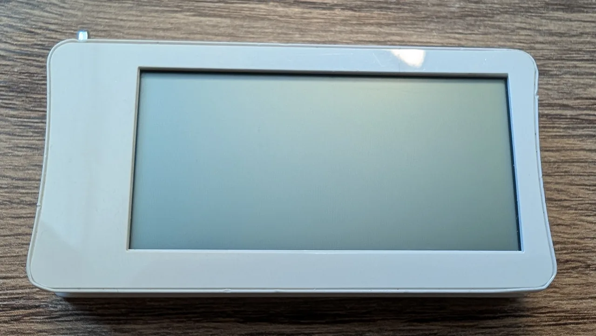
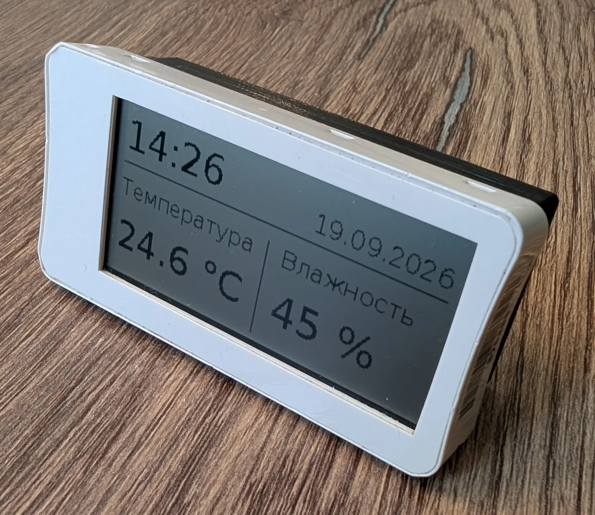

# GTag Display — экран электронного ценника для Home Assistant

**GTag Display превращает электронный ценник G-Tag в беспроводной экран
для Home Assistant.** Показывайте время, погоду, показания датчиков и состояние
устройств: выберите макет и источники данных в HA, и экран будет обновляться
автоматически.

Проект включает прошивку, интеграцию HA и инструкции по переделке ценника.
Используется штатный LCD 256×128 и дополнительная плата:

| Плата | Связь | Питание |
|---|---|---|
| nRF52840 Pro Micro / Super Mini / nice!nano | Zigbee2MQTT или Bluetooth | Аккумулятор |
| Super52840 | Zigbee2MQTT, отдельный профиль | Аккумулятор |
| ESP32-C3 Super Mini | Wi-Fi через ESPHome | USB |

| До: исходный ценник | После: данные Home Assistant |
|:---:|:---:|
|  |  |

[Задняя крышка для 3D-печати](https://www.thingiverse.com/thing:7411674).

## Возможности

- Часы, один показатель, часы с двумя показателями, три показателя или текст,
  погода с почасовым прогнозом и график истории.
- Настройка в HA: выбор сущностей, подписи, единицы, округление и предпросмотр.
- Автоматические обновления, импорт/экспорт макетов и произвольная отрисовка.
- Несколько независимых экранов, восстановление связи и значок устаревших данных.
- Контроль аккумулятора на nRF52840: напряжение, шкала заряда и защита от разряда.
- Рендеринг простых шаблонов на устройстве с передачей строк вместо изображения.
  Шаблоны отмечены 🌿; [порядок обновления](docs/device-template-update.md).
  Старые прошивки и неподдерживаемый текст используют передачу изображения.

[Макеты с изображениями и примерами настроек](docs/screens.md).

## С чего начать

1. **Подготовьте ценник и подключите плату.**
   [Подготовка экрана](docs/display-preparation.md) ·
   [GPIO nRF52840](docs/pin-remapping.md) ·
   [ESP32-C3 и Wi-Fi](docs/esp32-wifi.md).
2. **Установите GTag Display через HACS.** Добавьте
   `https://github.com/lukdut/gtag-nrf-display` как репозиторий типа **Integration**,
   скачайте интеграцию и перезапустите HA.
   [Установка через HACS или вручную](docs/installation.md).
3. **Настройте и прошейте плату.** Создайте YAML в
   [мастере GTag](docs/firmware-wizard.md) и импортируйте его в ESPHome Device Builder.
   [Сборка и прошивка](docs/esphome-flashing.md) ·
   [Полный пример конфигурации](docs/device-configuration.md).
4. **Подключите устройство к HA.** Для Zigbee установите
   [конвертер и добавьте экран через Zigbee2MQTT](docs/zigbee-home-assistant.md).
   Для Bluetooth выберите обнаруженный GTag; ESP32 сначала добавьте в ESPHome,
   затем в GTag Display.
5. **Выберите содержимое.** Откройте настройки GTag Display, выберите макет
   и сущности, проверьте предпросмотр и нажмите «Применить».
   [Настройка экранов](docs/screens.md).

**Сохраните штатные питание LCD и тактирование DisplayCLK/S1.** GPIO и загрузчик
должны соответствовать вашей плате; измерение аккумулятора требует внешнего
делителя. Подробности — в [инструкции подключения](docs/display-preparation.md)
и [руководстве по аккумулятору](docs/battery.md).

## Обновления и документация

Готовые файлы доступны в [выпусках проекта](https://github.com/lukdut/gtag-nrf-display/releases).
Для рендеринга на устройстве используйте [порядок обновления](docs/device-template-update.md).
Изменения прошивки могут требовать обновления платы и конвертера вместе с HA —
смотрите инструкцию соответствующего выпуска.

| Задача | Руководство |
|---|---|
| Узнать, что изменилось | [История версий](CHANGELOG.md) |
| Перенести макет на другой экран | [Импорт и экспорт](docs/layout-transfer.md) |
| Проверить связь и найти ошибку | [Диагностика устройства](docs/device-diagnostics.md) |
| Настроить контроль актуальности | [Значок устаревших данных](docs/freshness.md) |
| Разобраться в протоколе и совместимости | [Версии прошивок и кодеки](docs/firmware-compatibility.md) |
| Собрать проект из исходников | [Локальная разработка](docs/development.md) |
| Запустить тесты и посмотреть результаты | [Проверки проекта](docs/testing.md) |

## Обсуждение и лицензия

[Группа проекта в Telegram](https://t.me/g_tag6).

Код распространяется по [лицензии MIT](LICENSE).
Шрифт DejaVu Sans сохраняет свою [лицензию](custom_components/gtag_ble_test/fonts/LICENSE.txt).
