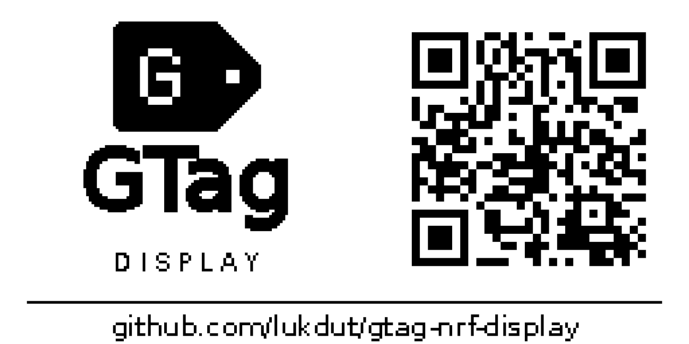

# Стартовая заставка GTag

Стартовая заставка для LCD 256×128: эмблема ценника с пиксельной буквой G, название
GTag Display, QR-код и читаемая ссылка на репозиторий. Заставка предназначена
для показа после включения до первого кадра от Home Assistant.



- [Кадр в исходном разрешении](boot-logo.png): 256×128, один бит на пиксель.
- [Векторная эмблема](gtag-mark.svg): исходная геометрия для дальнейшего использования.
- QR содержит `https://github.com/lukdut/gtag-nrf-display`, без сокращателей ссылок.
  Версия 3, коррекция M, модуль 3×3 пикселя, свободная белая зона по 4 модуля.
  Распознавание проверяется по готовому кадру в исходном разрешении.

Заставка включена по умолчанию в локальные профили BLE и Zigbee, включая
Super52840. Она появится после установки новой прошивки; в beta.3 её ещё нет.
Кадр хранится во flash (4096 байтов), выводится один раз, затем заменяется первым
принятым кадром. Дополнительных таймеров, опросов или буферов RAM для неё нет.
Для отключения задать `gtag_display: {boot_test_pattern: none}`; доступны также
`white`, `black`, `checkerboard`, `stripes`. Номера диагностических рисунков
Zigbee2MQTT остаются прежними (0–3).

18 сентября 2026 года заставка проверена на физической Super52840:
пользователь подтвердил корректное изображение и переход на репозиторий
при сканировании QR телефоном. После прошивки устройство вернулось
в прежнюю сеть Zigbee, новый кадр HA получил статус `displayed`.
Для Pro Micro прошивка собрана; физическая проверка заставки на ней ещё не выполнена.

## Воспроизведение

В отдельном окружении Python установить зависимости для подготовки изображения:

```sh
python -m pip install Pillow==12.3.0 qrcode==8.2 zxing-cpp==3.0.0
python scripts/render_boot_logo.py
```

Генератор использует шрифт DejaVu Sans, уже включённый в проект. Он сохраняет
PNG/SVG и `config/esphome/components/gtag_display/boot_logo.h` с готовым кадром
в формате LCD (левый пиксель — младший бит, белый — 1). Заголовок включён
в исходники, поэтому обычная сборка ESPHome не требует генератора.
Его зависимости нужны только для изменения и проверки заставки;
HA и прошивка их не используют.
