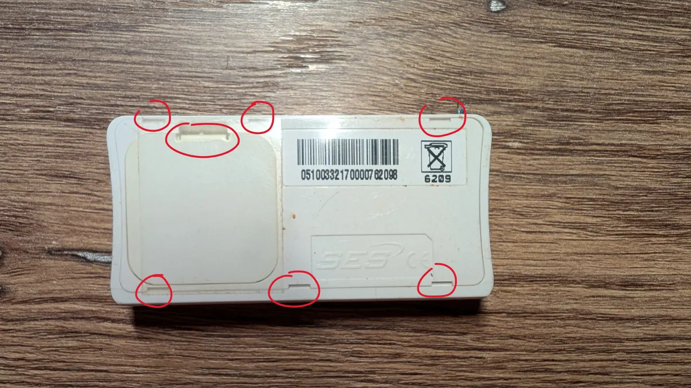
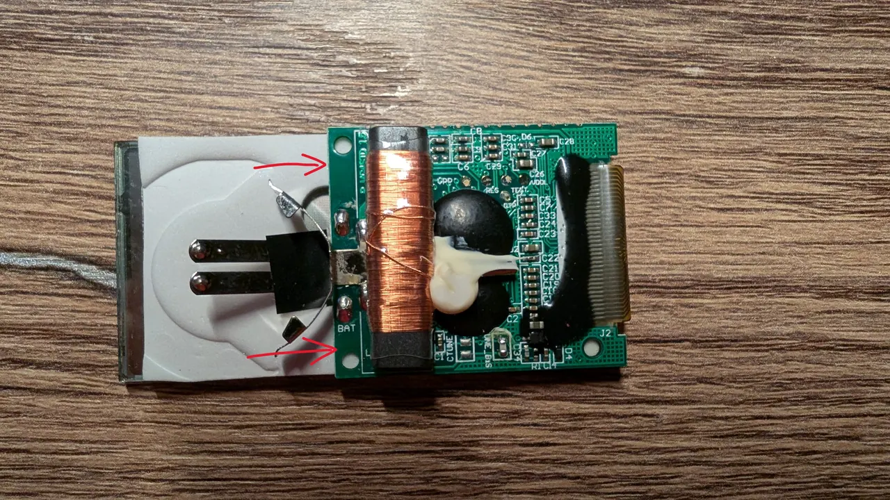
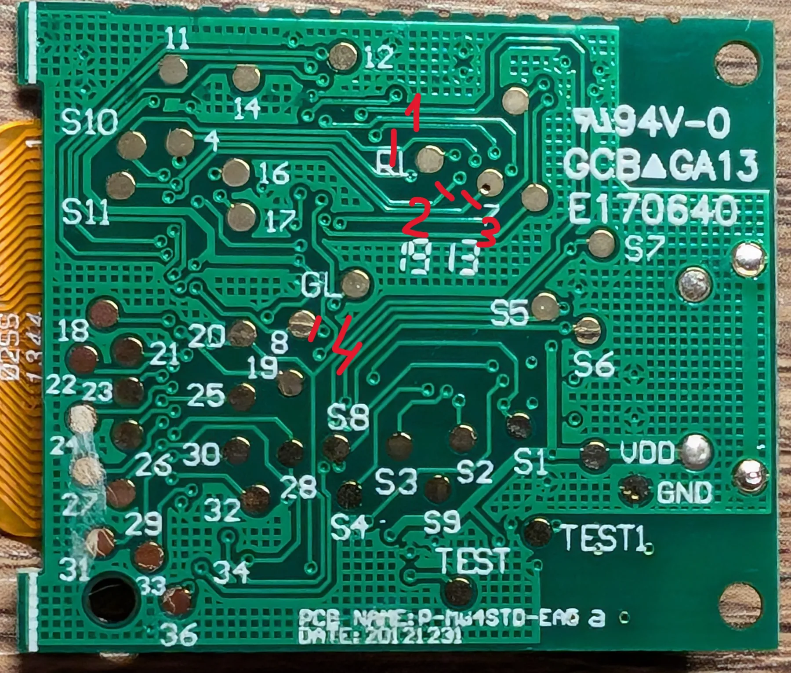
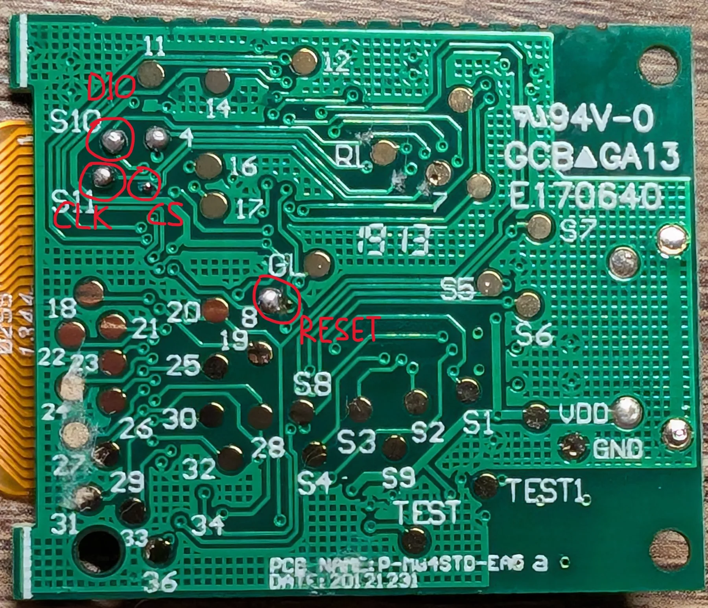
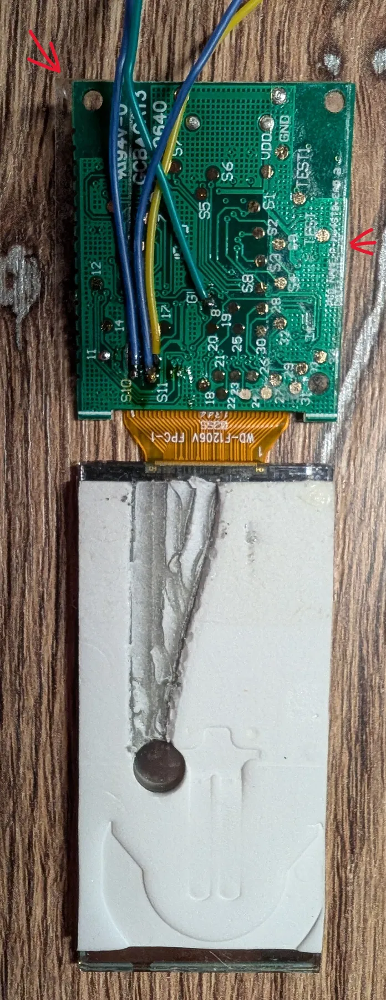
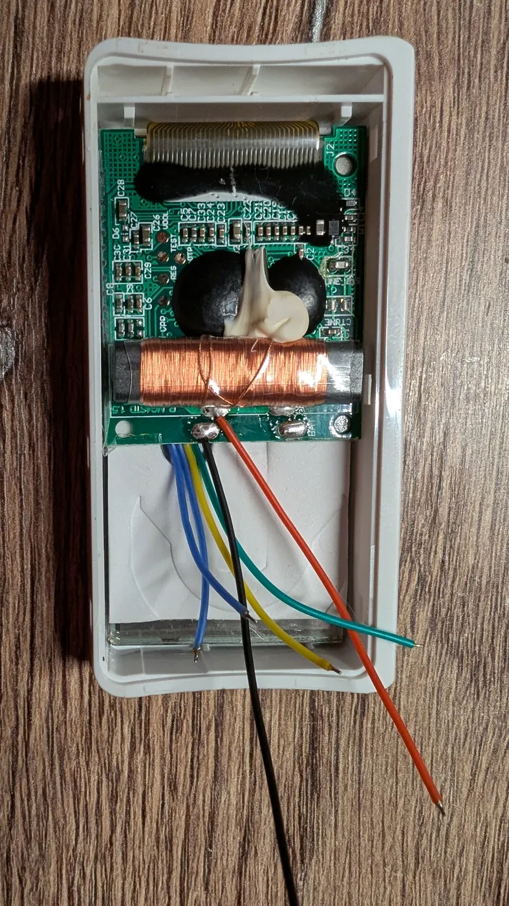

# Подготовка экрана G-Tag

Пошаговая подготовка LCD от электронного ценника к подключению платы nRF52840.
На фотографиях показана плата с маркировкой **WD-E-P-M4STD-EAG a**.
Перед разрезанием дорожек сравните свою плату с фотографиями: расположение
переходных отверстий у разных вариантов может отличаться.

Штатная плата ценника остаётся в сборке: питание LCD и тактирование
**DisplayCLK / S1** должны сохраняться. К nRF52840 выводятся четыре сигнала:
**DIO, CLK, CS и RESET**. Здесь **CLK** — тактовая линия передачи данных;
это отдельный сигнал, не DisplayCLK / S1.

Понадобятся небольшая плоская отвёртка, инструмент для перерезания дорожек,
паяльник, тонкие изолированные провода, тонкий двусторонний скотч и мультиметр.
Перед работой выньте штатные элементы питания, отключите аккумулятор и USB,
если они уже подключены.

## 1. Открыть корпус

Подденьте защёлки отвёрткой в отмеченных местах, откройте корпус и достаньте
сборку платы с экраном.

## 2. Отклеить плату от экрана

Аккуратно подденьте край платы, показанный стрелками. Она держится на
двустороннем скотче ближе к краю экрана. Прикладывайте небольшое постоянное
усилие: скотч постепенно отпустит плату. Не тяните резко и не натягивайте шлейф.

## 3. Перерезать четыре дорожки

Очистите обратную сторону платы от остатков скотча механически или спиртом.
Дайте поверхности высохнуть. Перережьте дорожки **в четырёх местах**, отмеченных
красными штрихами и цифрами 1–4 на фотографии.

Это отделяет линии управления LCD от штатного контроллера для подключения
nRF52840. После работы проверьте мультиметром, что каждый разрез разрывает
нужную дорожку, а соседние дорожки остались целыми.

**Вариант разводки возле контрольной площадки 7.** На некоторых платах
переходное отверстие находится рядом с площадкой 7, а не на ней. В таком
варианте разрез можно сделать на дорожке, ведущей к переходному отверстию,
а провод припаять к площадке 7 вместо зачищенного переходного отверстия,
показанного на следующем фото. Сверьте разводку и прозвоните соединения
после разреза.

## 4. Подготовить точки пайки

Найдите четыре точки **DIO, CLK, CS и RESET**, подписанные на фотографии.
Подготовьте и залудите их. Для показанного варианта CS подключается к небольшому
зачищенному переходному отверстию рядом с точкой CLK.

Перед пайкой отметьте, какой провод относится к каждому сигналу: цвета проводов
можно выбрать любые, назначение определяется точкой подключения.

## 5. Припаять провода и подготовить место для них

Удалите лишний двусторонний скотч на обратной стороне экрана, чтобы получилась
канавка для проводов. В показанной сборке скотч убирали паяльником, разогретым
примерно до **180 °C**. Работайте только со скотчем, не касаясь жалом стекла и
шлейфа.

Припаяйте четыре сигнальных провода, укладывая их вдоль поверхности платы
в направлении канавки. Они не должны торчать перпендикулярно плате.
По краям платы приклейте тонкий двусторонний скотч для обратной сборки.

## 6. Собрать экран и вывести питание

Уложите провода в канавку и приклейте плату на прежнее место, не пережимая
провода и шлейф. Припаяйте два провода питания к точкам, показанным на фотографии:
**красный — плюс, чёрный — минус / GND**. Проверьте полярность и отсутствие
замыкания перед подачей питания.

Соедините сигнальные провода с nRF52840 и объедините землю плат. Для стандартной
конфигурации **Pro Micro / Super Mini / nice!nano** используются следующие выводы:

| Провод от экрана | Вывод nRF52840 |
|---|---|
| DIO | P0.11 |
| CLK | P1.04 |
| CS | P1.06 |
| RESET | P1.13 |
| GND | GND |

Для другой разводки укажите фактические GPIO в YAML перед сборкой прошивки:
[переназначение выводов и Super52840](pin-remapping.md).
Питание LCD и штатный DisplayCLK / S1 сохраняются; прошивка nRF52840
не генерирует этот сигнал.

Подключение LiPo к плате nRF52840 и необязательного делителя описано отдельно
в [инструкции по аккумулятору](battery.md). Если делителя нет, измерение
нужно явно [отключить в конфигурации](device-configuration.md#обязательные-параметры).

После сборки переходите к [установке прошивки и интеграции](installation.md),
затем к [настройке содержимого экрана](screens.md).
