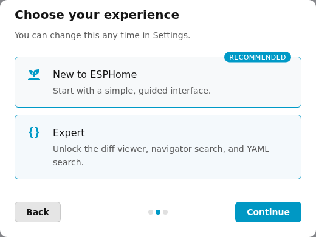
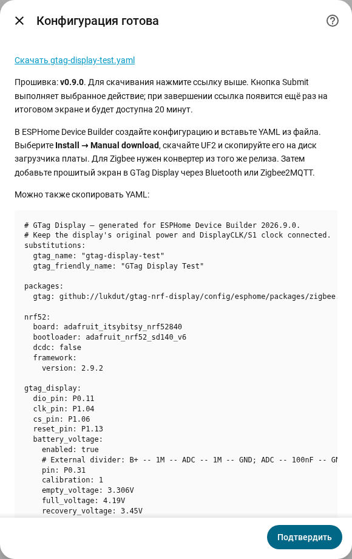
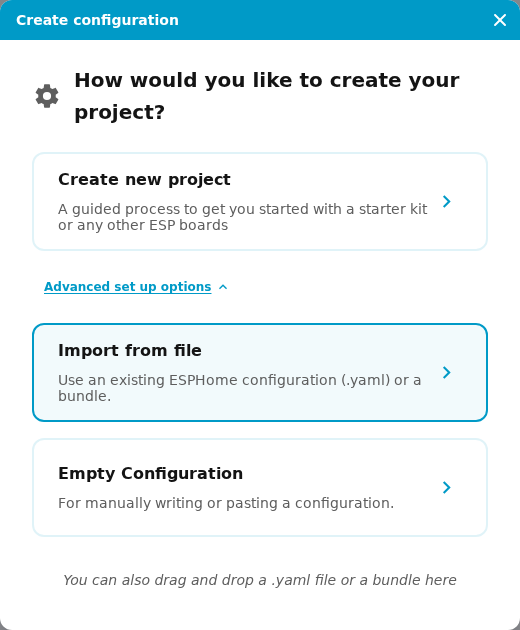
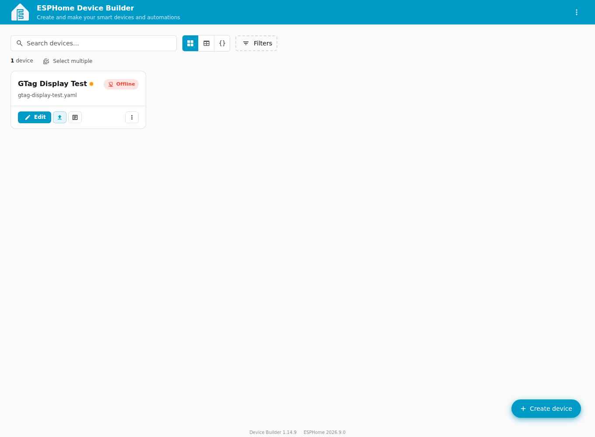
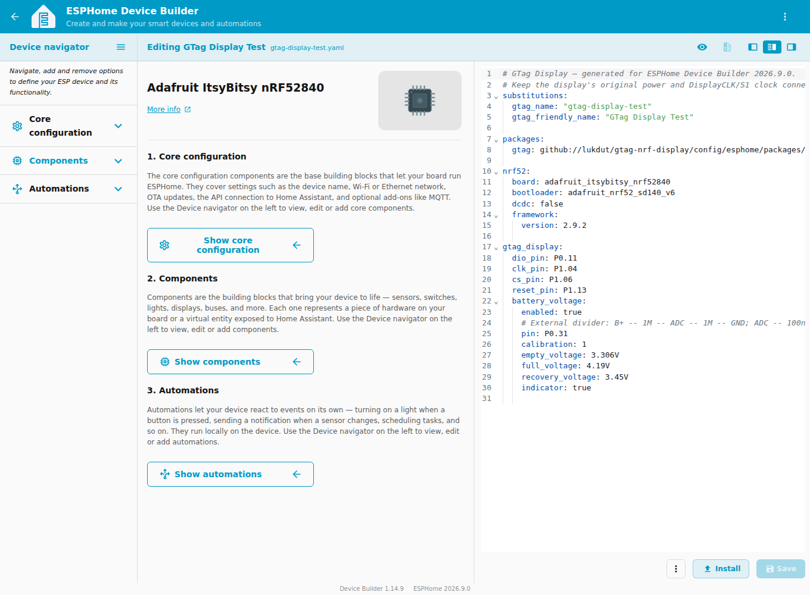
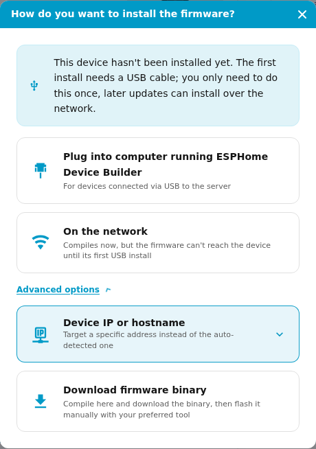
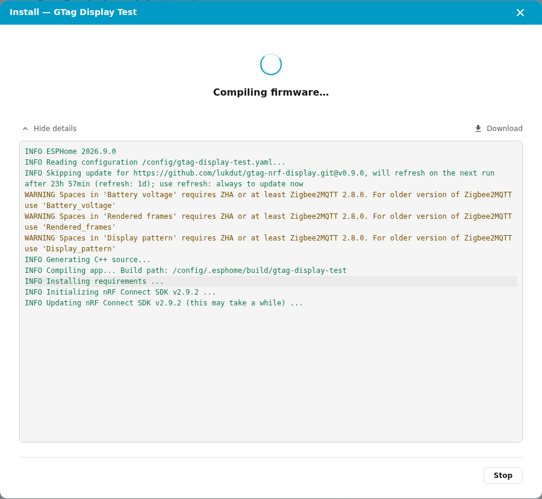
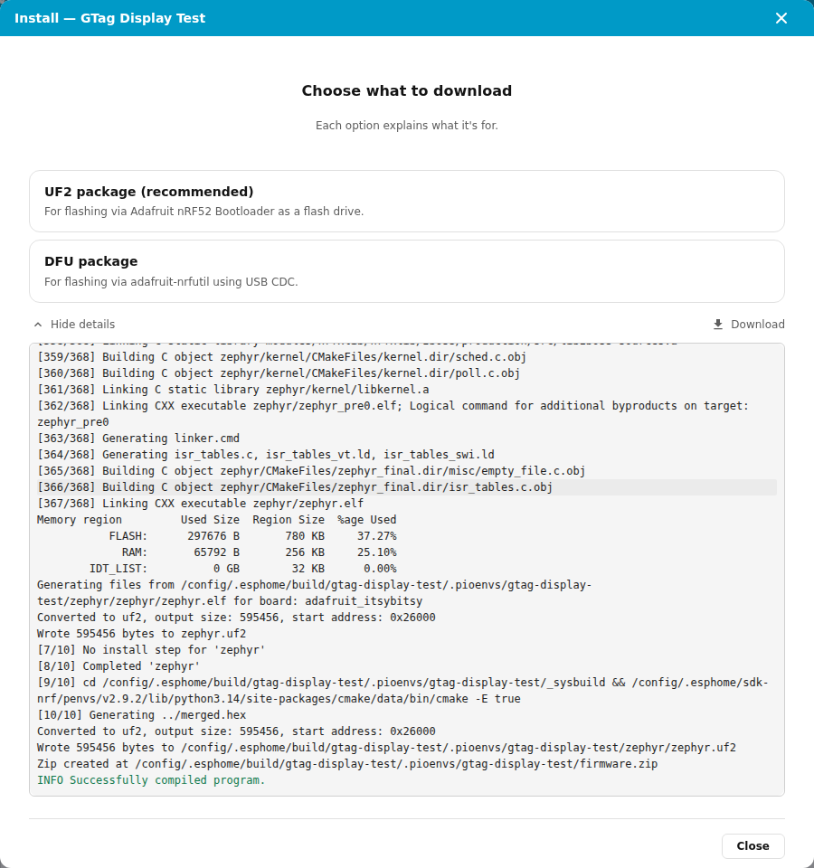
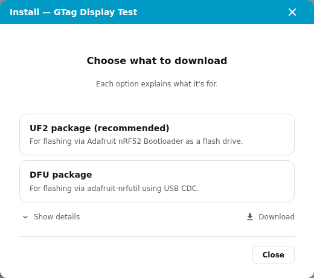

# Сборка и прошивка через ESPHome: пошаговая инструкция

Для GTag ESPHome собирает прошивку из YAML. Готовый файл **UF2** скачивается
на компьютер и копируется на USB-диск загрузчика nRF52840. После прошивки
экран подключается к интеграции **GTag Display** через Zigbee2MQTT или Bluetooth.
Содержимое экрана затем меняется в HA без пересборки.

Для ESP32-C3 с Wi-Fi используются BIN и OTA:
[отдельная инструкция подключения и прошивки](esp32-wifi.md).

Скриншоты сняты в **ESPHome 2026.9.0 / Device Builder 1.14.9** на Linux amd64.
Пример — **Pro Micro / Super Mini / nice!nano, Zigbee, внешний делитель батареи**.
Для своей платы сначала выберите соответствующие GPIO, загрузчик и батарею.

## 1. Откройте ESPHome Device Builder

### Home Assistant OS

Откройте **Настройки → Приложения → Установить приложение**, найдите
**ESPHome Device Builder**, нажмите **Установить → Запустить → Открыть веб-интерфейс**.
В прежних версиях HA этот раздел называется «Дополнения».
Если ESPHome нет в списке, добавьте репозиторий
`https://github.com/esphome/home-assistant-addon` в меню репозиториев магазина.
[Официальная установка ESPHome](https://esphome.io/install/).

### Home Assistant Container

Запустите ESPHome отдельным контейнером рядом с HA. Для него нужен Docker Engine
с Compose на Linux. В проверенном стенде используются 4 ГБ ОЗУ и диск 32 ГБ
для HA и ESPHome; перед установкой оставьте хотя бы 10 ГБ свободного места:
первая сборка скачивает образ, SDK и инструменты компилятора.

На сервере создайте каталог:

```bash
mkdir -p ~/esphome/config
cd ~/esphome
```

Сохраните в `compose.yaml`:

```yaml
services:
  esphome:
    image: ghcr.io/esphome/esphome:2026.9.0
    container_name: esphome
    restart: unless-stopped
    ports:
      - "6052:6052"
    env_file:
      - .env
    environment:
      TZ: Europe/Moscow
    volumes:
      - ./config:/config
      - /etc/localtime:/etc/localtime:ro
    logging:
      driver: json-file
      options:
        max-size: "10m"
        max-file: "3"
```

Рядом создайте `.env`, указав **свои** имя пользователя и пароль:

```dotenv
ESPHOME_USERNAME=admin
ESPHOME_PASSWORD='replace-with-your-password'
```

Затем выполните:

```bash
chmod 600 .env
sudo docker compose up -d
```

Откройте `http://АДРЕС-СЕРВЕРА:6052` и войдите с данными из `.env`.
Это отдельный интерфейс ESPHome; его учётная запись не создаётся автоматически
из пользователя HA. Каталог `config` хранит YAML и кеш сборки между
перезапусками контейнера. [Документация ESPHome в Docker](https://esphome.io/install/docker/).

Для скачивания UF2 не требуется передавать USB в виртуалку или контейнер:
плата подключается к компьютеру, на который вы скачаете файл.

При первом открытии пройдите приветствие: **Continue → Expert → Continue →
Maybe later**. В этой инструкции выбран Expert для доступа к редактору YAML.



## 2. Подготовьте YAML своей платы

В интеграции GTag Display откройте **Добавить запись → Подготовить прошивку
(YAML для ESPHome)**. Выберите плату, способ связи, уникальное имя, GPIO
и параметры аккумулятора, затем нажмите **Скачать …yaml**.
[Все шаги мастера](firmware-wizard.md).

Мастер доступен начиная с **1.0.0**. Также можно использовать
[полный пример конфигурации](device-configuration.md).
В 1.1.1 мастер Zigbee использует **v1.1.1** с оптимизациями сна,
а мастер Bluetooth сохраняет **v0.9.0**. Публичные YAML выпуска используют **v1.1.1**.
На скриншотах показан мастер из проверенной версии до выпуска 1.0.0.



Не включайте измерение батареи, если внешний делитель не припаян.
GPIO и профиль загрузчика должны соответствовать именно прошиваемой плате.

## 3. Импортируйте файл в ESPHome

На главной странице нажмите **Create device → Advanced set up options →
Import from file** и выберите скачанный `.yaml`.
Можно также перетащить файл в окно создания конфигурации.



ESPHome создаст карточку устройства и откроет редактор. Чтобы открыть его
позднее, нажмите **Edit** на карточке. Если у вашей версии интерфейса нет
импорта файла, используйте **Empty Configuration** и вставьте полный YAML.



**Offline в ESPHome для GTag ожидаем:** эта прошивка обменивается данными
через Bluetooth или Zigbee и не предоставляет обычное сетевое подключение
ESPHome API. Работу экрана проверяйте в интеграции GTag Display и Zigbee2MQTT.

## 4. Проверьте настройки и запустите сборку

В YAML проверьте `gtag_name`, пакет Bluetooth/Zigbee, `bootloader`, четыре GPIO
экрана и блок `battery_voltage`. После ручного изменения нажмите **Save**.
Надпись **Adafruit ItsyBitsy nRF52840** в редакторе соответствует выбранному
профилю сборки; на Pro Micro не нужно менять её на случайную плату ESP32.



Нажмите **Install → Advanced options → Download firmware binary**.
В прежнем интерфейсе тот же путь называется **Install → Manual download**.
Пункты установки по сети и сообщения мастера ESPHome об OTA не относятся
к текущей прошивке GTag: здесь используется копирование UF2.



Первая сборка скачивает исходники, nRF Connect SDK и компилятор, поэтому
может занять заметно больше времени, чем последующие. **Show details**
открывает журнал. Дождитесь успешного завершения сборки.



## 5. Скачайте UF2 и прошейте плату

После сообщения **Successfully compiled program** появится выбор формата.



Нажмите **UF2 package (recommended)**. В примере браузер скачивает
`gtag-display-test-zephyr.uf2`. Кнопка **Download** рядом с **Show details**
скачивает журнал сборки; для прошивки нужна именно кнопка **UF2 package**.
Для копирования на диск загрузчика используются UF2, а не DFU-архив,
`.bin` или `.hex`.



1. Подключите нужную плату к компьютеру USB-кабелем с передачей данных.
2. Дважды быстро нажмите **Reset**. Если кнопки нет, дважды кратковременно
   замкните **RST → GND**. Появится USB-диск загрузчика; его буква может отличаться.
3. При первой прошивке откройте `INFO_UF2.TXT` на этом диске и сверьте профиль:
   Pro Micro / nice!nano в проекте использует **S140 6.x**, Super52840 — **S140 7.x**.
   [Профили плат и GPIO](pin-remapping.md).
4. Скопируйте скачанный `.uf2` в корень диска загрузчика и дождитесь завершения
   записи. Плата перезапустится; диск исчезнет, поскольку USB в рабочей
   прошивке GTag отключён. Для следующей прошивки снова нужен двойной Reset.

Этот способ записи соответствует
[инструкции ESPHome для Adafruit nRF52 Bootloader](https://esphome.io/components/nrf52/#flashing-with-adafruit-nrf52-bootloader).

Исчезновение диска при перезапуске ожидаемо, но сообщение Windows об ошибке
копирования само по себе не подтверждает успешную запись. Проверьте стартовую
заставку, связь и версию прошивки в диагностике GTag; при необходимости
повторите запись после нового двойного Reset.

## 6. Подключите экран в HA

Для Zigbee установите [конвертер соответствующего релиза](zigbee-home-assistant.md),
добавьте устройство в Zigbee2MQTT, затем выберите его в интеграции GTag Display.
Для Bluetooth выберите Bluetooth при добавлении GTag. Обычная интеграция
**ESPHome** в разделе устройств HA для этого экрана не нужна.

Откройте **Настроить → Диагностика устройства → Проверить связь**, затем
[настройте макет](screens.md) и проверьте картинку на экране.
При обновлении существующей платы того же профиля сопряжение Zigbee сохраняется.
Если включали или выключали измерение батареи, выполните повторное Interview
в Zigbee2MQTT и перезагрузите запись GTag в HA.

После сборки ESPHome можно остановить: текущие обновления изображения идут
между HA и экраном и не требуют работающего Device Builder.
