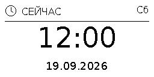
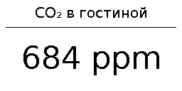
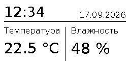
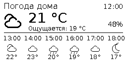
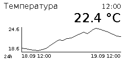

# Макеты экрана: описание и примеры

Содержимое экрана настраивается в Home Assistant и автоматически обновляется
при изменении данных. Готовые макеты работают через Zigbee и Bluetooth;
для смены макета перепрошивка не нужна.

| Макет | Что показывает | Пример использования |
|---|---|---|
| [Часы и дата](#часы-и-дата) | Крупное время, дата и день недели | Часы на рабочем столе |
| [Один крупный показатель](#один-крупный-показатель) | Подпись и одно значение | CO₂ в комнате, температура, заряд аккумулятора |
| [Время и два показателя](#время-и-два-показателя) | Время и дата сверху, два значения снизу | Температура и влажность |
| [Погода и почасовой прогноз](#погода-и-почасовой-прогноз) | Текущие условия и шесть ближайших записей прогноза | Погода дома на ближайшие часы |
| [Значение и график](#значение-и-график) | Текущее значение и история одного датчика | Температура за сутки, мощность за час |

Ниже — изображения из того же рендера, который используется интеграцией,
в исходном размере **256×128**. Данные демонстрационные; указанные в примерах
ID сущностей нужно заменить на свои. Все примеры готовых макетов настраиваются
через интерфейс, без YAML и автоматизаций.

## Настройка через интерфейс

Откройте **Настройки → Устройства и службы → GTag Display** и нажмите
значок шестерёнки **Настроить / Configure** справа от нужной записи интеграции.
Выберите **Настроить макет**, затем нужный вариант из таблицы выше.
Задайте интервал обновления, перейдите к выбору сущностей и проверьте предпросмотр.
Для часов шаг выбора сущностей пропускается.

В этом же меню доступны **Экспортировать текущий макет** и
**Импортировать макет из файла** — для [переноса на другой экран
или обмена шаблонами](layout-transfer.md). Каждый экран имеет свои настройки.

## Общие настройки

Для макетов с одним или двумя показателями можно выбрать датчики, помощники
или другие сущности HA; отображается их состояние. Для погоды нужна сущность
`weather`, для графика — числовая сущность с историей. Пустые подписи используют
имена сущностей. Для показателей пустые единицы берутся из `unit_of_measurement`.
Можно задать свои подписи и единицы или
указать `-`, чтобы скрыть единицу. Своя единица меняет только подпись,
а не пересчитывает значение. Недоступные значения показываются как `—`.
Текст подстраивается под ширину поля; слишком длинный сокращается многоточием.

Для одного или двух показателей и текущего значения над графиком есть поле
**Знаков после запятой**: **Без округления** (по умолчанию) или 0–6.
Например, `23.456` при выборе 1 отображается как `23.5`,
при выборе 0 — как `23`, при выборе 2 — как `23.46`. Число знаков фиксированное:
`23.4` при выборе 2 становится `23.40`. Текстовые состояния не округляются,
исходная сущность HA не изменяется. Настройка действует на предпросмотр и LCD
и сохраняется после перезапуска. Для её появления достаточно обновить интеграцию;
перепрошивка плат не требуется. Если меняются только скрытые знаки, повторная
передача того же кадра не нужна; подтверждения актуальности продолжают работать.

На следующем шаге появится предпросмотр с текущими данными. **Применить**
сохраняет настройки и ставит кадр в очередь передачи. **Изменить** возвращает
к выбору макета; **Обновить предпросмотр** показывает свежие значения. Закрытие
диалога до применения оставляет текущий экран и настройки без изменений.
Предпросмотр в диалоге не вызывает подключения к плате.
С версии 0.6.1 он отображается в размере 256×128 с непрозрачным белым фоном,
независимо от светлой или тёмной темы HA.

Минимальный интервал задаёт паузу после предыдущей попытки передачи: 5–3600 с,
по умолчанию 5 с. Он действует и на `draw`, и на кнопку обновления. Если данные
меняются чаще, отправляется их последнее состояние после этой паузы.
Это ограничение частоты, а не опрос датчиков по таймеру: сущности отслеживаются
по событиям, часы обновляются раз в минуту.

Применённый макет сохраняется после перезапуска. Вызов `draw`, тестовый рисунок
или включение **Clock screen** заменяют активный экран. Чтобы вернуть выбранный
макет, снова откройте настройки и примените его; прежние значения полей сохранены.
Перезапуск HA сам по себе не отменяет более поздний вызов `draw`.
При ошибке передачи настройки остаются сохранёнными, ошибку показывает диагностика;
повторить передачу можно кнопкой **Refresh display**.

Собственные статусы передачи не предлагаются в качестве источников данных:
их отслеживание вызвало бы непрерывные обновления. Датчик **Напряжение
аккумулятора / Battery voltage** доступен для выбора: он обновляется независимо
от перерисовки экрана. Для него нужны [делитель и прошивка с АЦП](battery.md).

Полоску заряда внизу и значок устаревших данных рисует сама плата поверх
полученного кадра. На примерах ниже они не показаны. Их поведение описано
в разделах [о батарее](battery.md#полоска-заряда-на-экране) и
[об актуальности изображения](freshness.md).

## Часы и дата



Крупные часы в центре, дата снизу и сокращённый день недели на русском сверху.
Время берётся из часового пояса HA и обновляется каждую минуту. Никакие
дополнительные интеграции времени или сущности датчиков не нужны.

**Как получить такой экран:** выберите **Часы и дата**, нажмите **Далее**
и примените предпросмотр. Подойдёт для первой проверки подключения.

## Один крупный показатель



Название сверху и одно крупное значение под разделителем. Подходит, когда
показатель должен читаться с расстояния. Можно выводить число с единицей
или текстовое состояние. Например, у `binary_sensor` выводится исходное
`on` / `off`; для своей надписи используйте [шаблон в произвольном экране](#шаблоны-и-автоматические-обновления).

Пример настроек для датчика CO₂ со значением `684`:

| Поле | Значение в примере |
|---|---|
| Макет | Один крупный показатель |
| Первая сущность | `sensor.living_room_co2` |
| Первая подпись | `CO₂ в гостиной` |
| Первые единицы измерения | Пусто — `ppm` берётся из сущности |
| Знаков после запятой — первый показатель | `0` |

## Время и два показателя



Время и дата находятся в верхней части, ниже — две независимые колонки
с подписями и значениями. Удобен для пары «температура + влажность»;
вместо них можно выбрать любые две доступные сущности. Подписи, единицы
и точность задаются отдельно для каждого показателя.

Пример настроек при температуре `22.456 °C` и влажности `48 %`:

| Настройка | Первый показатель, слева | Второй показатель, справа |
|---|---|---|
| Сущность | `sensor.room_temperature` | `sensor.room_humidity` |
| Подпись | `Температура` | `Влажность` |
| Единицы измерения | Пусто — `°C` из сущности | Пусто — `%` из сущности |
| Знаков после запятой | `1` → `22.5 °C` | `0` → `48 %` |

Если число вместе с единицей не помещается в колонку, шрифт уменьшается.
Уменьшите количество знаков после запятой или сократите подпись единицы,
чтобы значение оставалось крупным.

## Погода и почасовой прогноз



Выберите сущность `weather` с поддержкой почасового прогноза, например от
установленной погодной интеграции HA. Наверху — название, время, температура,
значок условий и влажность. Если источник передаёт ощущаемую температуру,
под текущей температурой появляется строка **«Ощущается: …»**. Ниже —
шесть ближайших будущих записей прогноза
с временем, значком и температурой. Если провайдер даёт данные реже, чем раз
в час, показываются фактические времена записей. Время переводится в часовой
пояс HA, температура использует единицы выбранной погодной сущности.

Пример настроек для погоды с текущей температурой `21 °C`, ощущаемой `19 °C`
и влажностью `48 %`:

| Поле | Значение в примере |
|---|---|
| Макет | Погода и почасовой прогноз |
| Первая сущность | `weather.home` |
| Первая подпись | `Погода дома` |

Нужна именно погодная сущность с **почасовым** прогнозом: обычный датчик
температуры и прогноз только по дням не подходят. Подпись можно оставить
пустой, тогда используется имя сущности. Количество колонок фиксировано —
шесть; отдельного выбора периода нет. Температура и влажность округляются
до целых, настройка знаков после запятой для этого макета не предлагается.

Начиная с **1.0.1**, «Ощущается» берётся из атрибута `apparent_temperature` выбранной `weather`
в тех же единицах, что текущая температура, и округляется до целых.
Настраивать отдельный датчик не требуется. Если атрибута нет, он недоступен
или содержит некорректное значение, строка скрывается. Самостоятельно
рассчитывать ощущаемую температуру интеграция не пытается.

Прогноз запрашивается через стандартное действие
[`weather.get_forecasts`](https://www.home-assistant.io/actions/weather.get_forecasts/)
с `type: hourly`. Дополнительные шаблонные датчики и автоматизации не нужны.
Запросы одного источника объединяются между экранами и кешируются на 10 минут;
текущая погода обновляется по изменениям сущности. Неизменные данные
перерисовываются раз в минуту с учётом заданного минимального интервала отправки.

При недоступной сущности или отсутствующем прогнозе соответствующие поля
показывают `—`. Старый прогноз после ошибки запроса не выдаётся за новый.

## Значение и график



Выберите числовую сущность `sensor`, `number` или `input_number` и период
**1–168 часов** (по умолчанию 24). Подпись, единицы и точность текущего значения
настраиваются как у других показателей. Своя единица меняет подпись,
а не пересчитывает данные. Шкала строится автоматически по видимым значениям;
крайние значения подписаны слева, границы времени — снизу.

Пример настроек для температуры комнаты с текущим значением `22.4 °C`:

| Поле | Значение в примере |
|---|---|
| Макет | Значение и график |
| Первая сущность | `sensor.room_temperature` |
| Первая подпись | `Температура` |
| Первые единицы измерения | Пусто — `°C` берётся из сущности |
| Знаков после запятой — первый показатель | `1` |
| Период истории, часы | `24` |

Для недавних изменений выберите `1` или `6` часов, для недельного обзора —
`168`. График использует только выбранную сущность. Округление относится
к крупному текущему значению; линия строится по исходным значениям истории.

История берётся из **Recorder**: он должен быть включён, а выбранная сущность
не должна быть исключена из записи. Доступный период зависит от срока хранения
Recorder. Без истории текущее значение остаётся на экране, график показывает
прочерк. Состояния `unknown`/`unavailable`, нечисловые значения и изменения
единиц измерения создают разрыв. Разные единицы не смешиваются на одной шкале.

Запрос одной сущности и периода кешируется на минуту. Чтение БД и отрисовка
выполняются вне основного цикла HA. Запрос ограничен 10 001 изменением состояния
плюс начальное состояние. При достижении лимита возле периода появляется `…`:
показывается доступная начальная часть истории; уменьшите период для полного
графика. При уменьшении числа точек сохраняются пики внутри каждого пиксельного
столбца. Минутное обновление сдвигает временное окно даже при постоянном значении.

Оба макета поддерживают [экспорт и импорт](layout-transfer.md). Формат файла
остаётся v1; новые типы макетов требуют интеграции 1.0.0 или новее.
Нижние три строки свободны для полоски батареи, которую рисует сама плата.
Перепрошивка для новых макетов не нужна.

## Первый тест: часы

Быстрая альтернатива выбору макета: откройте устройство **GTag Display**
и включите **Clock screen**. Он показывает тот же экран «Часы и дата».
Выключение переключателя останавливает обновления и оставляет последний кадр.
Своя отрисовка через `draw` или кнопка **Send RLE test image** выключают часы.
Включённый режим часов восстанавливается после перезапуска HA.

## Свой экран

В **Инструменты разработчика → Действия** выберите **GTag Display: Draw screen**,
затем своё устройство в поле **Display**. Переключитесь в YAML: HA уже подставит
`device_id`. Это идентификатор устройства из HA, а не его BLE-адрес и не entity_id.

Пример статичного экрана:

```yaml
action: gtag_ble_test.draw
data:
  device_id: ВАШ_DEVICE_ID
  background: white
  elements:
    - type: icon
      name: home
      x: 8
      y: 8
      size: 24
    - type: text
      x: 40
      y: 10
      text: "Привет, дом!"
      size: 22
    - type: line
      x: 8
      y: 40
      x2: 247
      y2: 40
    - type: text
      x: 128
      y: 60
      align: center
      text: "Всё работает"
      size: 26
```

Отрисовка выполняется в HA. nRF52840 получает обычный кадр по существующему
протоколу кадров BLE или Zigbee; дополнительная прошивка не нужна.

## Шаблоны и автоматические обновления

`auto_update: true` включён по умолчанию. Интеграция сохраняет макет и отслеживает
сущности, использованные в текстовых шаблонах. `now()` обновляется раз в минуту.
Изменившийся шаблон вызывает отрисовку. Если изображение изменилось, по выбранному транспорту
отправляется полный кадр с обычным сжатием RAW/WHITE_RLE_V1.

HA сам вычисляет шаблоны в действиях и сценариях до вызова интеграции. Чтобы
сохранить шаблон для дальнейшего отслеживания, оберните его в `` /
``. Например, этот экран достаточно отправить один раз из действий:

```yaml
action: gtag_ble_test.draw
data:
  device_id: ВАШ_DEVICE_ID
  auto_update: true
  elements:
    - type: text
      x: 128
      y: 20
      align: center
      size: 48
      text: "{{ now().strftime('%H:%M') }}"
    - type: text
      x: 128
      y: 88
      align: center
      size: 22
      text: "{{ now().strftime('%d.%m.%Y') }}"
```

Для датчика замените текст, например, на
`"{{ states('sensor.room_temperature') }} °C"`, указав
существующую у вас сущность. При прямом вызове сервиса из Python/REST, без
обработки сценариями HA, передавайте обычное `{{ ... }}` без обёртки `raw`.

Можно использовать обычные шаблоны без `raw` в автоматизации, которая сама
запускается при изменении датчиков. Тогда интеграция получает готовые строки;
`auto_update` не создаёт новых подписок для уже вычисленных значений.
При `auto_update: false` сохранённые шаблоны вычисляются только при вызове
действия или нажатии **Refresh display**. После перезапуска HA сохранённый
макет отправляется один раз независимо от этого параметра.

## Формат макета

Начало координат — левый верхний угол. Размер — 256×128, допустимые координаты
`x: 0..255`, `y: 0..127`. Все элементы имеют `type`, `x`, `y` и необязательный
`color: black|white` (по умолчанию `black`). Фон `background` по умолчанию белый.
Элементы накладываются в порядке списка; части за краем экрана обрезаются.

| type | Поля |
|---|---|
| `text` | `text`, `size: 8..64` (20), `align: left|center|right` (left), необязательный `max_width: 1..256` |
| `line` | `x2`, `y2`, `width: 1..8` (1) |
| `rectangle` | `x2`, `y2`, `width: 1..8` (1), `filled: true|false` (false) |
| `icon` | `name`, `size: 8..64` (24) |

Значения в скобках — по умолчанию. У текста `x` обозначает левый край, центр
или правый край согласно `align`; `y` — верх текста. `\n` переносит строку,
расстояние между началами строк равно `size + 2` пикселя. Встроенный шрифт
DejaVu Sans поддерживает кириллицу. Иконки: `clock`, `calendar`, `thermometer`,
`humidity`, `home`. У прямоугольника `x2 >= x` и `y2 >= y`.
Максимум 64 элемента и 1024 символа в каждом тексте, включая результат шаблона.
Пустой список `elements: []` очищает экран цветом фона.
Если задан `max_width`, шрифт уменьшается от `size` до 8 пикселей; оставшийся
слишком длинный текст сокращается многоточием. Без этого поля действует
обычное обрезание по краю экрана.

## Очередь, диагностика и предпросмотр

В 0.9.0-beta.3 добавлена настройка срока актуальности изображения и автономный
значок отсутствия подтверждений. По умолчанию — 15 минут, 0 отключает контроль.
[Поведение значка и коротких подтверждений](freshness.md).

- Запросы, пришедшие рядом, объединяются за 250 мс: ожидающая отрисовка
  заменяется самой свежей. Уже начатая передача завершается.
- Следующая передача начинается после минимальной паузы из настроек
  (по умолчанию 5 секунд) после окончания предыдущей попытки.
  `force: true` также соблюдает этот интервал.
- При включённом контроле актуальности одинаковый кадр подтверждается короткой
  командой; его пиксели не передаются повторно. При отключённом контроле
  одинаковый кадр пропускается, если он успешно отправлен менее 15 минут назад.
  Это срок действия проверки на повтор, а не таймер периодической отправки.
  **Refresh display** и `force: true` всегда отправляют кадр повторно.
- После перезагрузки nRF нажмите **Refresh display**, если автоматических
  изменений экрана нет. Протокол v1 не сообщает HA о потере кадра при сбросе.
- **Display transfer** показывает `idle`, `queued`, `sending`, `sent`,
  `unchanged` или `error`. В атрибутах — `last_error` и отчёт о последней
  успешной передаче: CRC, сжатие, размер, число попыток и длительность.
- **Display preview** и **Last display update** меняются только после успешной
  проверки кадра на nRF и завершения сеанса. При ошибке сохраняется предыдущий
  результат. Это предпросмотр отправленных данных: обратного чтения LCD нет.
- Предпросмотр и время последней передачи хранятся в памяти HA; после его
  перезапуска появятся снова при следующей успешной отправке. Макет и режим
  часов сохраняются на диске.

При запросе ответа действие возвращает `status: sent` с отчётом, `unchanged`
или `superseded`, если ожидающий запрос заменён более новым. Ошибка передачи
возвращается вызывающему действию и попадает в диагностику. В режиме часов
следующая минута запускает новую попытку; для статичного экрана доступна
кнопка **Refresh display**.

Чтобы вывести предпросмотр на панель, добавьте сущность `image` через интерфейс
HA или карточку, подставив её фактический entity_id:

```yaml
type: picture-entity
entity: image.gtag_display_display_preview
show_name: false
show_state: false
```

### Сохранённый макет со старым положением заголовка

В шаблоне «Часы и два показателя» верхние время и дата сдвинуты вниз
на 5 пикселей: координаты `y=13` и `y=23`. Значения показателей и разделители
сохраняют прежние позиции. Ранее обновление интеграции не меняло уже сохранённый
макет, поэтому экран мог продолжать использовать старые `y=8` и `y=18`.

Теперь при загрузке интеграция обновляет макет, целиком совпадающий со старым
стандартным шаблоном для выбранных настроек. Пользовательские изменения
не совпадут с ним и сохранятся. Повторный запуск не добавляет новый сдвиг.
В уже установленной версии также можно открыть настройки устройства и повторно
применить стандартный шаблон: это создаст макет с актуальными координатами.
Перепрошивать плату для изменения расположения элементов не требуется.
